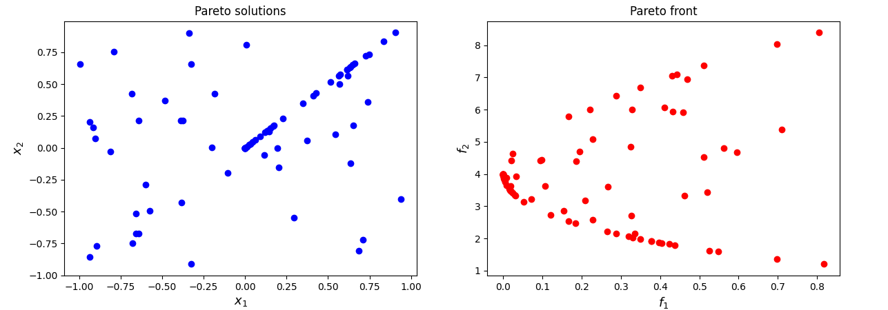

[](https://www.python.org/downloads/release/python-3106/)
[](https://opensource.org/licenses/Apache-2.0)
[](https://zenodo.org/badge/latestdoi/588524907)


## LM-Q-NWT: A Limited Memory Quasi-Newton Approach for Multi-Objective Optimization

### Installation

In order to execute the code, you need an [Anaconda](https://www.anaconda.com/) environment. We provide YAML file in order to facilitate the installation of the latter.

##### For Windows user

Open an Anaconda Prompt in the project root folder and execute the following command.

```
conda env create -f Environment_Setups/Windows.yml
```

##### For Linux user

Open a terminal in the project root folder and execute the following command.

```
conda env create -f Environment_Setups/Linux.yml
```

##### For MacOSX user

Open a terminal in the project root folder and execute the following command.

```
conda env create -f Environment_Setups/MacOSX.yml
```

#### Main Packages

* ```python v3.10.6```
* ```pip v22.2.2```
* ```numpy v1.22.3```
* ```scipy v1.7.3```
* ```matplotlib``` Windows: ```v3.5.3```, Linux: ```v3.5.2```, MacOSX: ```v3.6.1```
* ```tensorflow``` Windows: ```v2.9.1```, Linux: ```v2.8.2```, MacOSX: ```v2.10.0```
* ```gurobipy v9.5.2```
* ```progressbar2 v4.2.0```

#### Gurobi Optimizer

In order to run some parts of the code, the [Gurobi](https://www.gurobi.com/) Optimizer needs to be installed and, in addition, a valid Gurobi licence is required.

### Usage

In ```parser_management.py``` you can find all the possible arguments.
Given a terminal (an Anaconda prompt, if you are a Windows user), an example of execution could be the following.

```python main.py --algorithms LMQNWT --problems JOS --seeds 16007 --num_trials 100 --max_time 2 --verbose --plot_pareto_front --plot_pareto_solutions --general_export --export_pareto_solutions```

### Contact

If you have any question, feel free to contact me:

[Pierluigi Mansueto](https://webgol.dinfo.unifi.it/pierluigi-mansueto/)<br>
Global Optimization Laboratory ([GOL](https://webgol.dinfo.unifi.it/))<br>
University of Florence<br>
Email: pierluigi dot mansueto at unifi dot it
